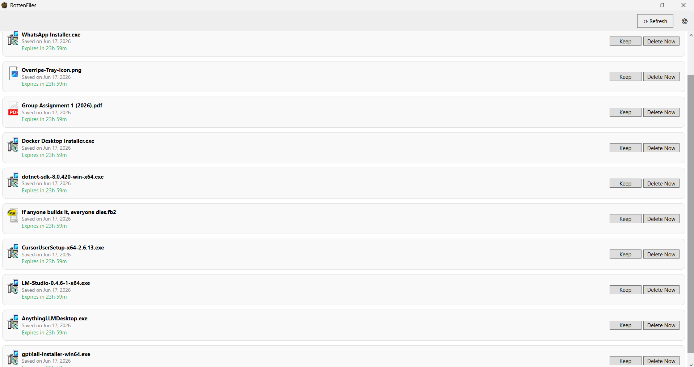

# RottenFiles

A lightweight Windows tray app that automatically deletes junk files after a set number of days, unless you tell it to keep them.



## Why I built this

My Downloads folder was a graveyard. Random PDFs from WhatsApp Web, installer files I ran once, screenshots I took for a single Slack message! All of it just sat there forever because deleting things manually requires remembering they exist in the first place. By the time I noticed a file, I had no idea if I still needed it or where it even came from.

RottenFiles is a "soft delete" buffer for your downloads. Save anything you're not sure about into a watched folder, set an expiry window, and forget about it. If you never think about the file again, it deletes itself. If you suddenly need it, one click rescues it before time runs out.

No more manually triaging clutter. No more 500 duplicate files because you couldn't find the original.

## Features

- **Set and forget** – save files to a designated folder; they expire after a chosen number of days.
- **Tray icon with badge** – the system tray icon shows a count of files expiring within 24 hours.
- **One‑click rescue** – open the main window and click **Keep** to move a file before it’s deleted.
- **Subfolder support** – any file inside the watched folder (including nested folders) is tracked.
- **Configurable notifications** – balloon tips remind you before files expire, or receive a daily digest.
- **Portable** – single executable, no installation required.

## Installation

1. Download the latest `RottenFiles_vX.X.X.zip` from the [Releases](https://github.com/shashvi-L/RottenFiles/releases/tag/v1.0.0) page.
2. Extract the archive anywhere you like.
3. Double‑click **RottenFiles.exe** — the app starts in the system tray.

> **Note:** Since this app isn't code‑signed, Windows SmartScreen may flag it as unrecognized on first launch. Click **More info** → **Run anyway** to proceed. This is expected for unsigned open‑source apps and will be revisited if the project grows.

## Usage

**Saving files**  
When you download or create a file, save it to `C:\RottenFiles` (or your custom watched folder). The app tracks every file added to that folder.

**Keeping files**  
Click the tray icon to open the main window. Each file has two buttons:  
- **Keep** — moves the file to a folder you choose.  
- **Delete Now** — removes the file immediately after confirmation.  

If you do nothing, the file is automatically deleted when its expiry date arrives.

**Tray icon**  
The tray icon always shows a rotten apple. A red badge appears when files are expiring within the next 24 hours. Left‑click opens the main window; right‑click shows a menu with Settings and Quit.

**Notifications**  
Balloon tips warn you before files expire. You can configure the timing in Settings.

## Settings

Right‑click the tray icon and choose **Settings** to adjust:

| Setting | Description |
| --- | --- |
| Expiry (days) | How many days before a file is automatically deleted (default 7). |
| Notify me | When to show a reminder: never, 24 hours before, 5 days before, daily digest, or a custom offset. |
| Watched folder | The folder the app monitors. Changing it clears the old list and starts fresh. |
| Start with Windows | Automatically run RottenFiles when you log in. |

## Building from source

Requirements:  
- [.NET 8 SDK](https://dotnet.microsoft.com/en-us/download/dotnet/8.0)  
- Windows 10 or 11  

```bash
git clone https://github.com/shashvi-L/RottenFiles.git
cd RottenFiles
dotnet build
dotnet run# RottenFiles

This is an early, solo‑built project — issues, feature requests, and pull requests are welcome. If something breaks or feels confusing, open an issue.
